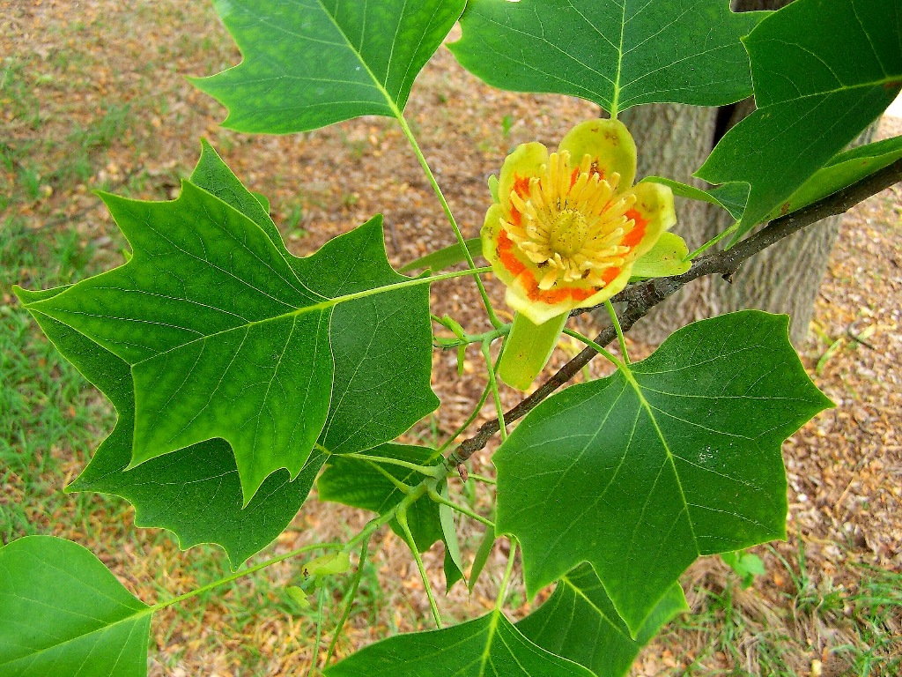
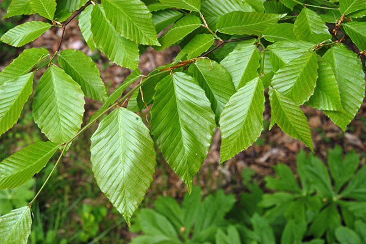

```{r setup, include=FALSE}
#Required libraries
library(tidyverse)  #importing, tidying, plotting data
library(knitr)      #making tables
library(leaflet)    #making dynamic maps
library(hexbin)
library(dplyr)
library(tidyr)
library(ggplot2)
library(ggfortify)
library(readxl)
library(grid)
library(gridExtra)
library(lubridate)

#disables all messages and warnings in final knit
knitr::opts_chunk$set(warning = FALSE, message = FALSE) 
```

{width="50%"}

## [**Table of Contents**]{style="color:red"}

-   Pictures
-   Stats
-   Tables
-   Plots
-   Maps

```{r data preparation, include=FALSE, warnings=FALSE}

outputs<-read_excel("data/LT50 master.xlsx")

#create column for julian date
outputs$julian_date <- yday(outputs$Date)

#create column for month
outputs <- mutate(outputs, month=month(outputs$Date))

#create column for year
outputs <- mutate(outputs, year=year(outputs$Date))

#Load NOAA Climate Data Online data
TN<-read.csv("data/tenn_climate.csv")

#omit NA in temperature recordings 
TN<-TN[complete.cases(TN[,15]),]

#for some reason R is very picky about the files from NOAA
#create column for month
TN <- mutate(TN, month=month(TN$DATE))

#create column for year
TN <- mutate(TN, year=year(TN$DATE))

## create column for julian date
TN$julian_date <- yday(TN$DATE)

phenology<-read_excel("data/phenology_check.xlsx")

#data prep
phenology <- mutate(phenology, year=year(date))

phenology$julian_date <- yday(phenology$date)

#omit any blank spots in the mean_phenology column
phenology <- phenology[complete.cases(phenology[,4]),]

#calculate mean phenology by julian date
phenology <- phenology%>%
  group_by(species, year, julian_date) %>%
  dplyr::mutate(mean_phenology=mean(phenology))

#calculate SD for phenology
phenology <- phenology%>%
  group_by(species, year, julian_date) %>%
  mutate(pheno_sd = sd(phenology, na.rm=TRUE))
```
## [Pictures]{style="color:red"}

There are three species common to all aspects of my research.

{width="50%"}

{width="50%"}

{width="50%"}

## [Plots]{style="color:red"}

Here are some example plots from one chapter of my thesis.

```{r plots, echo=FALSE, warnings=FALSE}
maple_phenology<-ggplot(data=subset(phenology, species=="Acer saccharum"), aes(x = julian_date, y=mean_phenology, color=factor(year))) +
  geom_point()+
  geom_errorbar(aes(y = mean_phenology, ymin = mean_phenology - pheno_sd, ymax = mean_phenology + pheno_sd), alpha = .2) +
  geom_line()+
  ylab("Phenology Code")+
  xlab("Julian Date")+
  ylim(-1, 5)+
  theme_bw()+
  ggtitle("Acer saccharum")

poplar_phenology<-ggplot(data=subset(phenology, species=="Liriodendron tulipifera"), aes(x = julian_date, y=mean_phenology, color=factor(year))) +
  geom_point()+
  geom_errorbar(aes(y = mean_phenology, ymin = mean_phenology - pheno_sd, ymax = mean_phenology + pheno_sd), alpha = .2) +
  geom_line()+
  ylab("Phenology Code")+
  xlab("Julian Date")+
  ylim(-1, 5)+
  theme_bw()+
  ggtitle("Liriodendron tulipifera")

beech_phenology<-ggplot(data=subset(phenology, species=="Fagus grandifolia"), aes(x = julian_date, y=mean_phenology, color=factor(year))) +
  geom_point()+
  geom_errorbar(aes(y = mean_phenology, ymin = mean_phenology - pheno_sd, ymax = mean_phenology + pheno_sd), alpha = .2) +
  geom_line()+
  ylab("Phenology Code")+
  xlab("Julian Date")+
  ylim(-1, 5)+
  theme_bw()+
  ggtitle("Fagus grandifolia")

grid.arrange(maple_phenology, poplar_phenology, beech_phenology, nrow=3)


dbl_panel <- filter(outputs, State == "TN", Date >= "2022-01-01")

jdate_TMIN <- TN %>%
  group_by(julian_date) %>%
  filter(year>1979) %>%
  summarise(temp = min(TMIN, na.rm = TRUE))

TMIN_2022 <- TN %>%
  group_by(julian_date) %>%
  filter(year==2022) %>%
  summarise(temp = min(TMIN, na.rm = TRUE))

TMIN_2023 <- TN %>%
  group_by(julian_date) %>%
  filter(year==2023) %>%
  summarise(temp = min(TMIN, na.rm = TRUE))

dbl_panel <- dbl_panel%>%
  group_by(Species, julian_date, year) %>%
  dplyr::summarise(LT50mod.m=mean(LT50),
                   LT50mod_sd=sd(LT50),
                   LT50mod_se=sd(LT50)/sqrt(6))

plot22 <-ggplot() +
  geom_point(data=subset(dbl_panel, year=="2022"), aes(x = julian_date, y=LT50mod.m, color= Species), position = position_dodge(width = 2))+
  geom_errorbar(data=subset(dbl_panel, year=="2022"), aes(x= julian_date, ymax=LT50mod.m+LT50mod_se,ymin=LT50mod.m-LT50mod_se, color= Species), width= 2, position = position_dodge(width = 2))+
  geom_line(data=jdate_TMIN, aes(x=julian_date, y=temp, color="grey"))+
  scale_color_manual(values = c("Acer saccharum" = "red", "Liriodendron tulipifera" = "blue", "Fagus grandifolia" = "black"))+
  scale_linetype_manual(values = c("2022 Temperatures" = "grey"))+
  xlim(40,130) +
  ylim(-20,10)+
  ylab("Temperature (°C)")+
  xlab("Julian Date")+
  theme_bw()+
  theme(panel.border = element_blank(),  
        panel.grid.major = element_blank(),
        panel.grid.minor = element_blank(),
        panel.background = element_blank(),
        axis.line = element_line(colour = "black"),
        axis.title.x = element_blank())+
  theme(legend.position="top", legend.box = "horizontal")+
  ggtitle(2022)

plot23 <-ggplot() +
  geom_point(data=subset(dbl_panel, year=="2023"), aes(x = julian_date, y=LT50mod.m, color= Species), position = position_dodge(width = 2))+
  geom_errorbar(data=subset(dbl_panel, year=="2023"), aes(x= julian_date, ymax=LT50mod.m+LT50mod_se,ymin=LT50mod.m-LT50mod_se, color= Species), width = 2, position = position_dodge(width = 2))+
  geom_line(data=jdate_TMIN, aes(x=julian_date, y=temp, color="grey"))+
  scale_color_manual(values = c("Acer saccharum" = "red", "Liriodendron tulipifera" = "blue", "Fagus grandifolia" = "black"))+
  xlim(40,130) +
  ylim(-20,10)+
  ylab("Temperature (°C)")+
  xlab("Julian Date")+
  theme_bw()+
  theme(panel.border = element_blank(),  
        panel.grid.major = element_blank(),
        panel.grid.minor = element_blank(),
        panel.background = element_blank(),
        axis.line = element_line(colour = "black"))+
  theme(legend.position="none")+
  ggtitle(2023)

grid.arrange(plot22, plot23,nrow=2, 
             top = textGrob("LT50 Values with Historical Coldest Temperatures by Julian Date",gp=gpar(fontsize=17,font=3)))
```

## [Stats]{style="color:red"}

A GLM looking at differences in LT50 values and a second looking at changes in phenology

```{r stats data preparation, include=FALSE, warnings=FALSE}

LT50_data<-read_excel("data/LT50 master.xlsx")

LT50_data$Species <- as.factor(LT50_data$Species)

LT50_data <- filter(LT50_data, State=="TN")

#add in column for julian date
LT50_data$julian_date <- yday(LT50_data$Date)

#add in column for year
LT50_data <- mutate(LT50_data, year=year(LT50_data$Date))

#bring in phenology data
pheno<-read_excel("data/phenology_check.xlsx")

#add in column for julian date
pheno$julian_date <- yday(pheno$date)

#add in column for year
pheno <- mutate(pheno, year=year(date))

#filter for core three species
pheno <- filter(pheno, species != "Ostrya virginiana")
pheno <- filter(pheno, species != "Quercus alba")


```

```{r stats, echo = FALSE, include=TRUE, warnings=FALSE}


mod1<-glm(LT50~(Species+julian_date+year)^2,data=LT50_data, na.action="na.fail")
summary(mod1)

mod2<-glm(phenology~(species+julian_date+year),data=pheno, na.action="na.fail")
summary(mod2)
```

## [Tables]{style="color:red"}

```{r tables, echo=FALSE, warnings=FALSE}
pheno_mod <- filter(pheno, species=="Acer saccharum", julian_date=="92" | julian_date == "99")
kable(pheno_mod[1:10, ], caption = 'Table 1. A knitr kable displaying the 10 phenology observations for sugar maples between julian day 90 and 100.')

kable(outputs[1:15, ], caption = 'Table 1. A knitr kable displaying the first 15 temperature thresholds for freezing.')
```

## [Maps]{style="color:red"}

I have spent an inordinate amount of time in these woods.

```{r Map, echo=FALSE, warnings=FALSE}
leaflet() %>%
  setView(-87.338498, 36.57008, zoom = 50) %>% #lat-long of the place of interest
  addTiles() %>%
  addMarkers(-87.338498, 36.57008, popup = "APSU Woodlot")
```

## [And with that, I am at the end of my presentation today]{style="color:red"}

<div class="tenor-gif-embed" data-postid="25013890" data-share-method="host" data-aspect-ratio="1.77778" data-width="100%"><a href="https://tenor.com/view/groovy-intergalactic-groovy-evil-dead-intergalactic-bruce-campbell-army-of-darkness-groovy-gif-25013890">Groovy Intergalactic Groovy GIF</a>from <a href="https://tenor.com/search/groovy-gifs">Groovy GIFs</a></div> <script type="text/javascript" async src="https://tenor.com/embed.js"></script>
